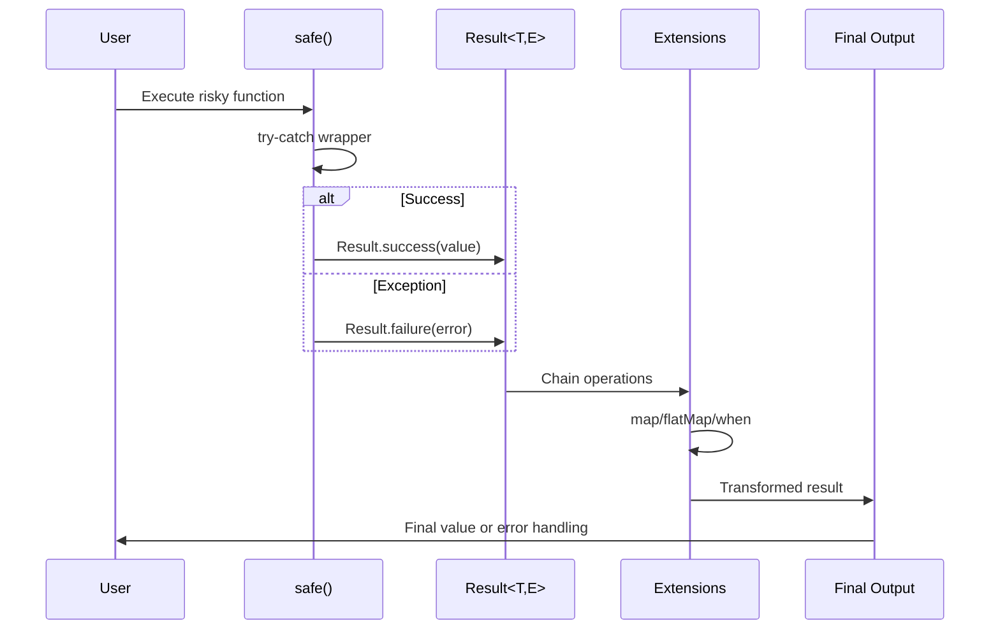

# Tryx Library - Architecture Overview

## 🏗️ System Architecture

```mermaid
graph TB
    subgraph "Public API Layer"
        A[safe() function] --> B[Result<T, E>]
        C[safeAsync() function] --> B
        D[Safe class] --> B
        E[safeWith() function] --> B
    end

    subgraph "Core Types"
        B --> F[Success<T, E>]
        B --> G[Failure<T, E>]
        H[SafeResult<T>] --> B
    end

    subgraph "Extensions Layer"
        I[ResultExtensions] --> B
        J[FutureResultExtensions] --> K[Future<Result<T, E>>]
        L[StreamResultExtensions] --> M[Stream<Result<T, E>>]
    end

    subgraph "Utilities"
        N[combineResults] --> B
        O[fromNullable] --> B
        P[fromBool] --> B
        Q[RetryPolicy] --> D
    end

    subgraph "Configuration"
        R[GlobalConfig] --> D
        S[ErrorMapper] --> D
        T[Logger] --> D
    end
```

## 🔄 Data Flow Architecture



## 🎯 Feature Matrix

| Feature         | Basic API     | Advanced API     | Stream API        | Future API         |
| --------------- | ------------- | ---------------- | ----------------- | ------------------ |
| Error Wrapping  | ✅ `safe()`   | ✅ `Safe.call()` | ✅ `safeStream()` | ✅ `safeAsync()`   |
| Method Chaining | ✅ `map/when` | ✅ All methods   | ✅ Stream ops     | ✅ Async ops       |
| Custom Errors   | ✅ Generic E  | ✅ Error mapping | ✅ Stream errors  | ✅ Async errors    |
| Retry Logic     | ❌            | ✅ RetryPolicy   | ❌                | ✅ With Safe class |
| Timeout         | ❌            | ✅ Duration      | ❌                | ✅ With Safe class |
| Logging         | ❌            | ✅ Custom logger | ❌                | ✅ With Safe class |

## 🚀 Performance Characteristics

### Memory Usage

- **Result<T, E>**: Single object allocation per operation
- **Success/Failure**: Sealed classes with minimal overhead
- **Extensions**: Zero-cost abstractions (compile-time)

### Execution Speed

- **safe()**: ~2-3x overhead vs raw try-catch (acceptable for safety)
- **Method chaining**: Optimized with pattern matching
- **Async operations**: Native Future performance

### Scalability

- **Stream processing**: Backpressure-aware
- **Batch operations**: `combineResults()` for efficient bulk processing
- **Memory efficient**: No intermediate collections in chains

## 🔧 Extension Points

### Custom Error Types

```dart
// Domain-specific errors
sealed class ValidationError extends Exception {
  const ValidationError();
  factory ValidationError.required(String field) = RequiredFieldError;
  factory ValidationError.format(String field) = FormatError;
}

// Usage
final result = await safeWith<User, ValidationError>(
  () => validateAndCreateUser(data),
  errorMapper: (e) => ValidationError.format('email'),
);
```

### Custom Retry Policies

```dart
class ExponentialBackoffPolicy extends RetryPolicy {
  const ExponentialBackoffPolicy({
    required super.maxAttempts,
    required Duration initialDelay,
    double backoffMultiplier = 2.0,
  }) : super(
    delay: initialDelay,
    backoffMultiplier: backoffMultiplier,
  );

  @override
  Duration getDelay(int attempt) {
    return Duration(
      milliseconds: (delay!.inMilliseconds *
        math.pow(backoffMultiplier, attempt)).round(),
    );
  }
}
```

### Global Configuration

```dart
class TryxConfig {
  static TryxConfig _instance = const TryxConfig();
  static TryxConfig get instance => _instance;

  const TryxConfig({
    this.defaultTimeout,
    this.globalLogger,
    this.defaultRetryPolicy,
  });

  final Duration? defaultTimeout;
  final void Function(Object error)? globalLogger;
  final RetryPolicy? defaultRetryPolicy;

  static void configure(TryxConfig config) {
    _instance = config;
  }
}
```

## 🧪 Testing Strategy

### Unit Tests Structure

```
test/
├── core/
│   ├── result_test.dart
│   └── safe_test.dart
├── extensions/
│   ├── result_extensions_test.dart
│   ├── future_extensions_test.dart
│   └── stream_extensions_test.dart
├── utils/
│   ├── combinators_test.dart
│   └── converters_test.dart
├── integration/
│   ├── real_world_scenarios_test.dart
│   └── performance_test.dart
└── examples/
    └── example_test.dart
```

### Test Categories

1. **Unit Tests**: Individual component testing
2. **Integration Tests**: End-to-end scenarios
3. **Performance Tests**: Benchmarking vs try-catch
4. **Example Tests**: Documentation examples validation

## 📊 Comparison with Alternatives

| Feature             | Tryx   | try-catch | dartz   | fpdart  |
| ------------------- | ------ | --------- | ------- | ------- |
| Learning Curve      | Low    | None      | Medium  | High    |
| Type Safety         | High   | Medium    | High    | High    |
| Performance         | Good   | Best      | Good    | Good    |
| Async Support       | Native | Native    | Limited | Good    |
| Stream Support      | Native | Manual    | Limited | Limited |
| Beginner Friendly   | ✅     | ✅        | ❌      | ❌      |
| Functional Style    | ✅     | ❌        | ✅      | ✅      |
| Flutter Integration | ✅     | ✅        | ✅      | ✅      |

## 🔮 Future Roadmap

### Phase 1: Core Implementation

- [ ] Basic Result<T, E> type
- [ ] safe() and safeAsync() functions
- [ ] Essential extensions (map, when, fold)
- [ ] Basic documentation

### Phase 2: Advanced Features

- [ ] Safe class with configuration
- [ ] Retry policies and timeout
- [ ] Stream integration
- [ ] Comprehensive testing

### Phase 3: Ecosystem Integration

- [ ] Flutter-specific utilities
- [ ] HTTP client integration
- [ ] Database operation helpers
- [ ] Performance optimizations

### Phase 4: Developer Experience

- [ ] IDE plugins/snippets
- [ ] Migration tools
- [ ] Advanced documentation
- [ ] Community examples

## 🎨 Design Decisions Rationale

### Why Sealed Classes?

- **Exhaustive pattern matching**: Compiler ensures all cases handled
- **Performance**: No virtual method calls
- **Type safety**: Impossible to create invalid states

### Why Function-First API?

- **Discoverability**: `safe()` is intuitive for beginners
- **Consistency**: Follows Dart conventions (runZoned, compute)
- **Flexibility**: Can be extended with Safe class for advanced usage

### Why Generic Error Types?

- **Flexibility**: Supports domain-specific errors
- **Type Safety**: Compiler catches error handling mistakes
- **Interoperability**: Works with existing exception hierarchies

### Why Method Chaining?

- **Readability**: Fluent API reduces nesting
- **Composability**: Easy to build complex error handling pipelines
- **Functional Style**: Appeals to developers from other languages

This architecture provides a solid foundation for a production-ready error handling library that scales from simple use cases to complex enterprise applications.
